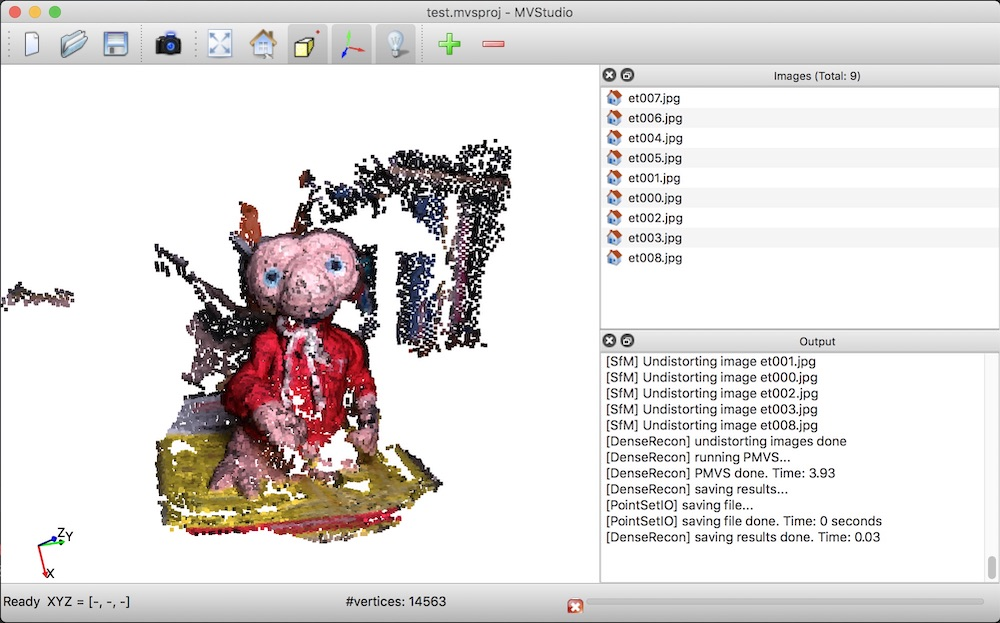

    <b>  </b>  
    <b>  </b>    

### About
**MVStudio** is a lightweight, easy to use, and integrated SfM (Structure from Motion) and MVS (Multi-View Stereo) solution. It is intended for learning/researching 3D computer vision.

 
      

---

### Build
MVStudio depends on some third-party libraries and all dependencies (except for Qt) are included in the distribution. To build MVStudio, you need Qt, CMake, and of course, a compiler:

- [Qt `>= 5.0`](http://download.qt.io/archive/qt/)
- [CMake `>= 3.1`](https://cmake.org/download/)
- a compiler that supports `>= C++11`

MVStudio has been tested on macOS (Xcode >= 8), Windows (MSVC >=2015), and Linux (GCC >= 4.8, Clang >= 3.3). Machines 
nowadays typically provide higher [supports](https://en.cppreference.com/w/cpp/compiler_support), so you should be able to build MVStudio on almost all platforms.

There are many options to build MVStudio. Choose one of the following (or whatever you are familiar with):

- Option 1: Use any IDE that can directly handle CMakeLists files to open the `CMakeLists.txt` in the root directory of 
MVStudio. Then you should have obtained a usable project and just build. I recommend using 
[CLion](https://www.jetbrains.com/clion/) or [QtCreator](https://www.qt.io/product).
- Option 2: Use CMake to generate project files for your IDE. Then load the project to your IDE and build.
- Option 3: Use CMake to generate Makefiles and then `make` (on Linux/macOS) or `nmake`(on Windows with Microsoft 
  Visual Studio).

Don't have any experience with C/C++ programming? Have a look at [How to build MVStudio step by step](./HowToBuild.md).

---

### How to use MVStudio

* Create a project 
  -  Goto menu _**File**_ -> _**New Project**_, choose a folder, fill in the project name and _Save_ the project file. The folder you choose will contain all (intermediate) results after reconstruction.
  - Goto menu _**File**_ -> _**Add Images**_, choose the folder containing the images. This can also be done by right-clicking the image pannel (upper right corner of the program).
 
* Reconstruction
  - Menu _**Runconstruct**_ -> _**Image Matching**_
  - Menu _**Runconstruct**_ -> _**Run Sparse (SfM)**_ and wait to see the sparse point cloud.
  - Menu _**Runconstruct**_ -> _**Run Dense (MVS)**_ and wait to see the dense point cloud.

---

### License
MVStudio is free software; you can redistribute it and/or modify it under the terms of the 
GNU General Public License as published by the Free Software Foundation; either version 3
of the License or (at your option) any later version. The full text of the license can be
found in the accompanying 'License' file.

Should you have any questions, comments, or suggestions, please contact me at: liangliang.nan@gmail.com

---

**_Liangliang Nan_**

https://3d.bk.tudelft.nl/liangliang/

March 26, 2018

Copyright (C) 2014
